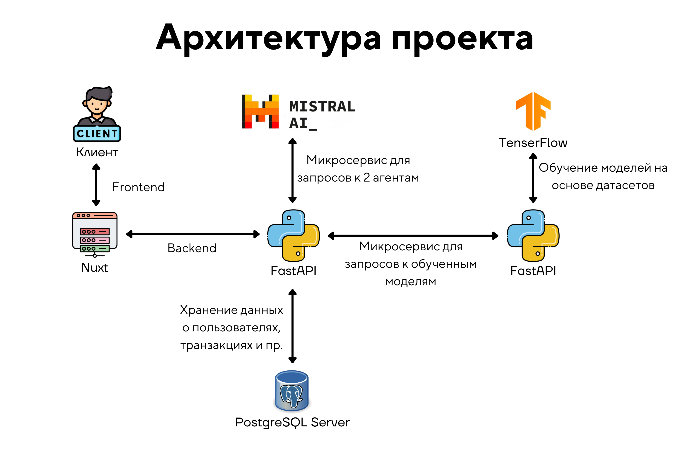

# Финансовый помощник

<hr>

### Давно страдаете от импульсивных покупок и не знаете, как решить эту проблему? Мы знаем, что делать!

Данный проект реализует backend часть веб-сайта с использованием фреймворка [FastAPI](https://fastapi.tiangolo.com/). 
Приложение предоставляет собой REST API для работы с пользователями, транзакциями, категориями покупок, 
а также советами от ИИ. Кроме того, проект включает интеграцию с внешними сервисами, такими как Mistral AI и 
API проверки чеков.

<hr>

## Обзор

Проект представляет собой масштабируемую backend систему, построенную на FastAPI. Основной функционал включает:
- Регистрацию, авторизацию и управление пользователями (с использованием JWT и куки).
- Управление транзакциями и категориями трат/доходов.
- Создание графиков с помощью Chart.js, отображающих транзакции по категориям и динамику расходов.
- Интеграцию с внешними сервисами: Mistral AI и API проверки чеков.
- Сканирование чеков и загрузку собственной истории транзакции в CSV.
- Хранение данных в PostgreSQL

<hr>

## Функциональные возможности

- **Пользователи:** регистрация и авторизация, обновление профиля, удаление аккаунта.
- **Транзакции:** создание, изменение, удаление и получение операций. Также автоматическое распознавание чеков (QR-сканер и API проверки чеков) 
и загрузка истории транзакций в формате CSV.
- **Категории покупок:** создание, изменение, удаление и получение категорий. Создание кастомных категорий.
- **Советчик:** запрос советов у ИИ в специальном чате.
- **Распознавание QR-кодов чеков:** обращение к API проверки чеков и распознавание содержимого с помощью ИИ.

<hr>

## Стек технологий

- Язык: **Python 3.12**
- Фреймворк для создания REST API: **FastAPI**
- ORM для работы с БД: **SQLAlchemy 2.0+ (асинхронная версия)**
- СУБД: **PostgreSQL**
- Аутентификация и авторизация: **JWT**
- Модуль для работы с внешними API: **aiohttp**
- Контейнеризация и оркестрация сервисов: **Docker & Docker Compose**

<hr>

## Запуск проекта
1. Клонируйте репозиторий
2. Пропишите команду в консоль `docker compose up --build`
3. Спецификация (Swagger): `http://localhost:8000/api/docs`

<hr>

## Конфигурация
- **База данных:** Используется асинхронная SQLAlchemy для работы с PostgreSQL. Настройки подключения определяются в файле `core/models/db_helper.py`
- **JWT:** Создание и проверка токенов реализованы в сервисе `api/auth/views.py`
- **Интеграции:** Для взаимодействия с Mistral AI реализованы эндпоинты в сервисе `api/ai/views.py`

<hr>

## Структура проекта

```plaintext
project/
├── api/                      # API маршруты
│   ├── ai/                   # Маршруты для работы с AI
│   │   └── views.py          # Эндпоинты Mistral AI
│   ├── auth/                 # Маршруты аутентификации
│   │   └── views.py          # JWT-авторизация
│   ├── categories/           # Маршруты категорий
│   │   ├── crud.py           # CRUD для категорий
│   │   ├── views.py          # API эндпоинты 
│   │   └── schemas.py        # Схемы для категорий
│   ├── transactions/         # Маршруты транзакций
│   │   ├── crud.py           # CRUD для транзакций
│   │   ├── schemas.py        # Схемы транзакций
│   │   └── views.py          # API эндпоинты 
│   ├── users/                # Маршруты пользователей
│   │   ├── views.py          # API эндпоинты 
│   │   └── schemas.py        # Схемы пользователей
│   └── utils/                # Вспомогательные утилиты
│       ├── datetime_utils.py # Утилиты для работы с датами
│       └── system.py         # Системные утилиты
├── core/                     # Ядро приложения
│   └── models/               # Модели базы данных
│       ├── db_helper.py      # Настройка подключения к БД
│       └── user.py, category.py и др. # Модели SQLAlchemy
├── docker-compose.yml        # Конфигурация Docker Compose
├── Dockerfile                # Инструкции для сборки образа
└── main.py                   # Точка входа приложения
```

<hr>

## Схема базы данных


<hr>

## Архитектура проекта 



<hr>

Команда "PRODuction"
